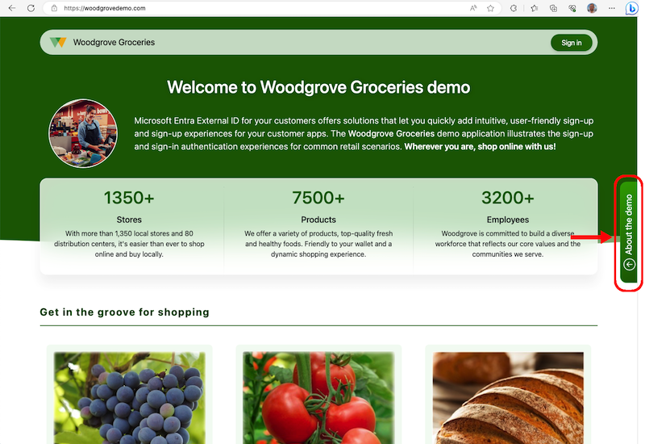

# 3Cloud CIAM Groceries demo 

Microsoft Entra External ID offers solutions that let you quickly add intuitive, user-friendly sign-up and sign-up experiences for your customer apps. The 3Cloud CIAM Groceries demo environment illustrates several of the most common authentication experiences that can be configured for your customer-facing apps.

To try out the demo environment, go to [3Cloud CIAM Groceries](https://3clouddemo-d5cye3cvfyeahzbv.centralus-01.azurewebsites.net/) and select from a list of use cases that illustrate different sign-in options and business cases. 

For more information about this demo application, read the [overview of the 3Cloud CIAM Groceries demo](https://learn.microsoft.com/entra/external-id/customers/overview-solutions-customers) article.

## Related GitHub repossitories

- [3Cloud CIAM custom authentication extension web API](https://github.com/3CloudSolutions/3Cloud-Auth-API)
- [3Cloud CIAM Groceries web API](https://github.com/3CloudSolutions/3Cloud-Groceries-API)
- [3Cloud CIAM Groceries middleware for Graph](https://github.com/3CloudSolutions/3Cloud-Middleware)
- [Microsoft CIAM Groceries clean up function](https://github.com/microsoft/woodgrove-CIAM-groceries-clean-up/)

### Related samples

- [Microsoft Entra ID Custom authentication extension sample](https://github.com/microsoft/authentication-events-function)
- [Microsoft Entra ID Custom authentication extension with SDK sample](https://github.com/microsoft/authentication-events-sdk-function)

## Support

This sample application and its source code created by Microsoft and modified by 3Cloud Engineers to demonstrate some of the Microsoft Entra Extrnal ID user flows. The application and its source code is not supported under any Microsoft standard support program or service. If you find a bug, notice something but are not sure how to solve it, or want to provide product feedback, use the [Issues](https://github.com/microsoft/woodgrove-groceries/issues) tab at the top of the page. You can also @mention collaborators who have access to this repository in an issue to draw their attention to a comment. 

## Using the source code

The objective of this project is to demonstrate various authentication user experiences. While it is possible to download and run the app locally, it's not recommended because the app is designed to support multiple flows within a single application, whereas a typical app utilizes a single sign-in flow. 

Examples of Microsoft Entra External ID are available at <https://aka.ms/eeid/samples>. For these examples, we provide instructions on how to download and use the samples or create your own application based on common authentication and authorization scenarios, development languages, and platforms.

## Contributing

This project welcomes contributions and suggestions from the community. We believe that collaboration and diverse perspectives can greatly enhance the quality and functionality of this live demo. Whether you have ideas for new features, improvements to existing ones, or simply want to provide feedback, we encourage you to get involved. Your input is invaluable in helping us create a better experience for all users. Thank you for your support and participation. For more information, [learn how to contribue to the 3Cloud CIAM live demo](./CONTRIBUTING.md).

## Privacy policy and terms of service

Your privacy is important to us. Our [privacy statement](https://3clouddemo-d5cye3cvfyeahzbv.centralus-01.azurewebsites.net/Privacy) explains the personal data processed by the 3Cloud CIAM Groceries demo application, how we process it, and for what purposes. We also recommend that you check out our [terms of service](https://3clouddemo-d5cye3cvfyeahzbv.centralus-01.azurewebsites.net/TOS).

